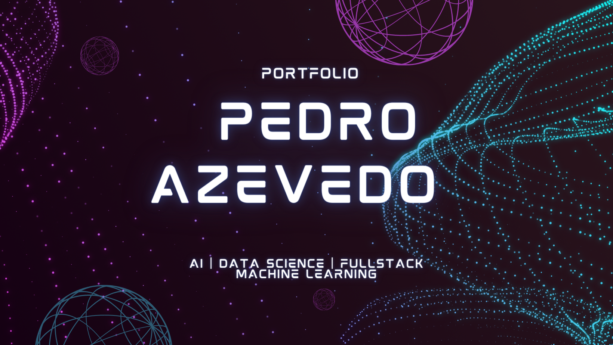
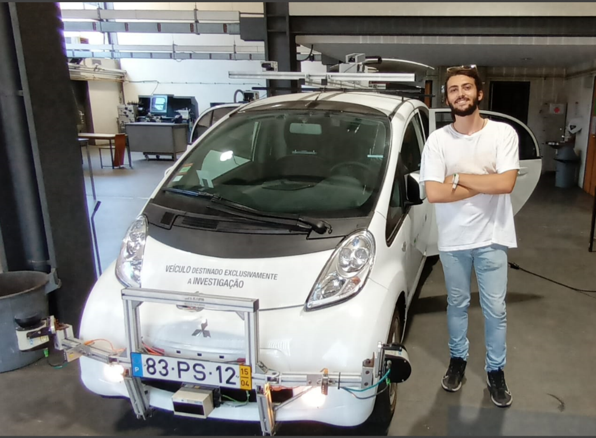

### Hi there 👋

<!--
**callmesora/callmesora** is a ✨ _special_ ✨ repository because its `README.md` (this file) appears on your GitHub profile.

Here are some ideas to get you started:

- 🔭 I’m currently working on ...
- 🌱 I’m currently learning ...
- 👯 I’m looking to collaborate on ...
- 🤔 I’m looking for help with ...
- 💬 Ask me about ...
- 📫 How to reach me: ...
- 😄 Pronouns: ...
- ⚡ Fun fact: ...
-->

 
 <h1 align = "center">Hi there, I'm Pedro Azevedo 👋</h1>

         

I'm passionate about __Machine Learning__ and __Data Science__. I am an industry level praticioner excited with the huge potential for __Artificial Intelligence__ in different domains. My previous work includes research & development in __Computer Vision__ , __Autonomous Driving__ , anomaly detection on __IOT Sensor Data__. 

Master of Mechanical Engineering with a major in __Computer Vision and Deep Learning__.

Previously worked on Driving assistance systems for Autonomous Vehicles on 
[__ATLASCAR2__](https://link.springer.com/chapter/10.1007/978-3-031-21065-5_25).

<h2>🪚🔧 My Skills 😀😀:</h2>

Having a classical Engineering background I excel at math physics and statistics which distinguish me with great capability to perform 
__machine learning engineer__ or a __data scientist__ taks. 

I have both Software Engineering and Data Science skills so I can take my models to life from Problem proposition , taking care of the data, deployment and building webapps to show them.

### Programming Languages

   

__Frameworks & Libraries__:

 
 

__Data Science Tools__

           

<!-- ## 💼🎒 My Portfolio Overview:

Unlock my expertise in __machine learning__ and __deep learning__ by exploring my completed projects. Links are below. I invite you to read the detailed descriptions at the bottom of this website. My portfolio shows diversity and depth of knowledge in __image recognition__, __natural language processing__ and more. Take a look at the summary below to see the impact of my work.

<h2 align = "center"> 🖥 My Machine Learning Projects </h2> 

| 🚴‍ [Washington Bike Demand Prediction](https://github.com/suhasmaddali/Washington-Bike-Demand-Prediction)| 🚙 [Car Prices Prediction](https://github.com/suhasmaddali/Car-Prices-Prediction)|
| :-:| :-:| 
| | 

| 🏦 [Predicting Loan Default](https://github.com/suhasmaddali/Predicting-Loan-Default-Using-Machine-Learning)| 🫀 [Heart Disease Prediction](https://github.com/suhasmaddali/Heart-Disease-Prediction)|
| :-:| :-:| 
| | 

| 🏚 [Airbnb Home Prices Prediction](https://github.com/suhasmaddali/Airbnb-Home-Prices-Prediction)| [☎️ __Telco Customer Churn Prediction__](https://github.com/suhasmaddali/Telco-Customer-Churn-Prediction)|
| :-:| :-:| 
| | |

<h2 align = "center"> 🖥 My Natural Language Processing (NLP) Projects</h2> 

| 📚 [Predicting Readability of Texts](https://github.com/suhasmaddali/Predicting-Readability-of-Texts-Using-Machine-Learning)| 👹 [Twitter Sentiment Analysis](https://github.com/suhasmaddali/Twitter-Sentiment-Analysis) |
| :-:| :-:| 
| | |

| 🗞 [Fake News Prediction](https://github.com/suhasmaddali/Fake-News-Prediction)| 
| :-:| 
| | 

<h2 align = "center"> 🖥 My Computer Vision Projects</h2>

| 🎋 [Wheat Disease Detection Using Deep and Transfer Learning](https://github.com/suhasmaddali/Wheat-Disease-Detection-)| 🕸 [Convolutional Neural Networks CNN Implementation Using Keras](https://github.com/suhasmaddali/Convoluted-Neural-Networks-CNN-Implementation-Using-Keras) |
| :-:| :-:| 
| | |

| 🌾 [Wheat Localization With Convolutional Neural Networks (CNNs)](https://github.com/suhasmaddali/Wheat-Detection-Using-Computer-Vision)| 🥄 [Steel Defect Detection](https://github.com/suhasmaddali/Steel-Defect-Detection-Challenge) |
| :-:| :-:| 
| | |

| 🔢 [MNIST Digits Classification](https://github.com/suhasmaddali/MNIST-classification-)| 
| :-:| 
| |

<h2 align = "center"> 🖥 My Unsupervised Machine Learning Projects</h2> 

| 📚 [Article Recommender System](https://github.com/suhasmaddali/Article-Recommender-System)| 
| :-: |
| | 

<h2 align = "center"> 🖥 My Data Visualization Projects </h2> 

| 📽 [YouTube Video Analysis](https://github.com/suhasmaddali/Youtube-Video-Analysis)| 🔍 [Google Play store Genre Prediction](https://github.com/suhasmaddali/Google-Play-Store-Genre-Prediction)|
| :-: | :-: | 
|  | |

<h2 align = "center"> 🖥 My SQL Projects</h2> 

| 🚕 [Cab Reservation System](https://github.com/suhasmaddali/Cab-Reservation-System-)|
| :-: |
| |

<h2 align = "center"> 🖥 My Web Scraping Projects</h2>

| 🍿 [IMDB Movies Web Scraping](https://github.com/suhasmaddali/Web-Scraping/blob/main/IMDB%20web%20scraping%20.ipynb)| 🍔 [Restaurant Recipes Web Scraping XML](https://github.com/suhasmaddali/Web-Scraping/blob/main/Recipes%20XML%20querying.ipynb)|
| :-: | :-: | 
|  | |

| 🎮 [Popular Gaming Titles Wikipedia Web Scraping](https://github.com/suhasmaddali/Web-Scraping/blob/main/Webscraping%20of%20Popular%20Gaming%20Titles%20Wikipedia.ipynb)| 🎒 [University Instructors Information Scraping](https://github.com/suhasmaddali/Web-Scraping/blob/main/XML%20document%20reading.ipynb)|
| :-: | :-: | 
|  | |

| 🔐 [JSON file Web Scraping](https://github.com/suhasmaddali/Web-Scraping/blob/main/Json%20File%20Reading%20.ipynb)| 
| :-: | 
|  | 

<h2 align = "center"> 🖥 My HTML5, CSS3 and Bootstrap Projects</h2>

| 🍔 [Adare Restaurant Webpage](https://github.com/suhasmaddali/Adare-Restaurant-Webpage) | 🏍🚲 [Roar Bikes Webpage](https://github.com/suhasmaddali/Roar-Bikes-Webpage) |
| :-: | :-: | 
|  | |

 -->
